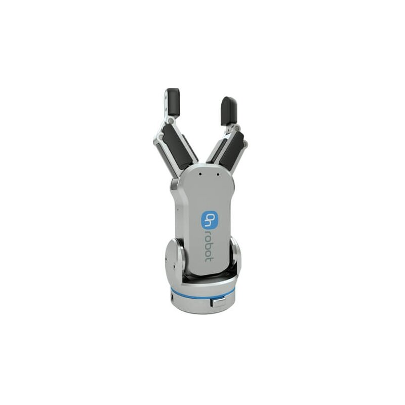

# **IsaacStack Assets**

Browse and download simulation-ready assets.

  
  <a href="https://omniverse-content-production.s3.us-east-2.amazonaws.com/Assets/Isaac/4.5/Isaac/Robots/Grippers/StandardGripper/standard_gripper.usd" download>
    Download Robotiq Gripper
  </a>

  
  <a href="https://omniverse-content-production.s3.us-east-2.amazonaws.com/Assets/Isaac/4.5/Isaac/Robots/UniversalRobots/ur5e/rg2.usd" download>
    Download RG2 Gripper
  </a>

