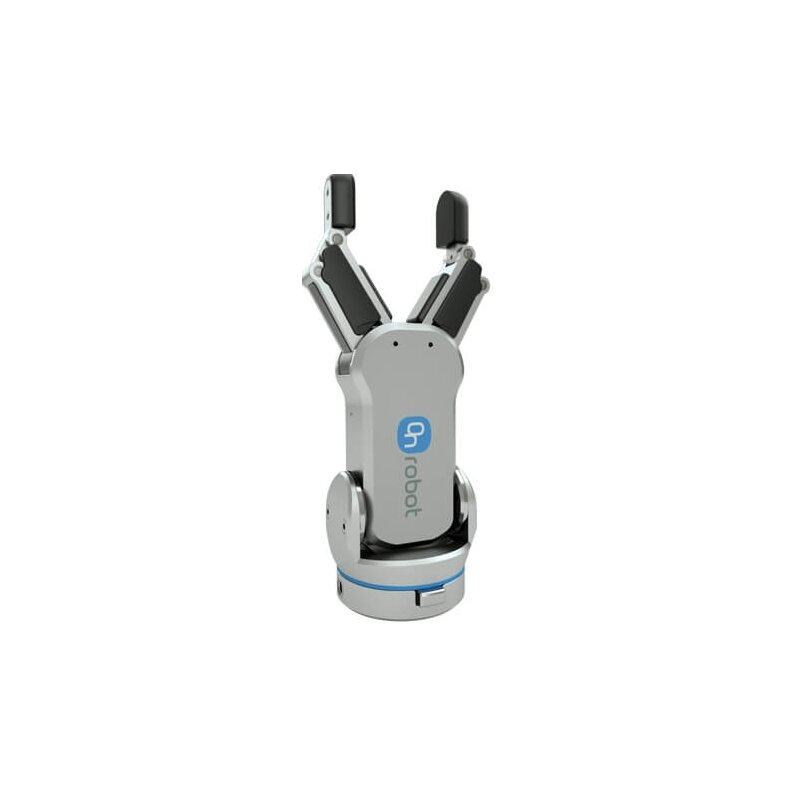

---
hide:
  - toc
---

# Blog

Welcome to the IsaacStack Blog — follow updates, tutorials, and insights here.

---

<!-- Post 1 -->

  
  <h3>Getting Started with IsaacStack</h3>
  
July 1, 2025

  
Understand the purpose of this site and how to use snippets, assets, and extensions effectively.

  <a href="post1/">Read More →</a>

<!-- Post 2 -->

  
  <h3>Rigging the Robotiq 2F-85 Gripper</h3>
  
July 2, 2025

  
Step-by-step guide to rig and articulate the Robotiq 2F-85 inside Isaac Sim with articulation config.

  <a href="../tutorials/post2/">Read More →</a>

<!-- Post 3 -->

  
  <h3>UR5e + Robotiq Extension</h3>
  
July 2, 2025

  
Create an Isaac Sim extension that sets up the UR5e robot with a fully rigged Robotiq 2F-85 gripper.

  <a href="../extensions/post3/">Read More →</a>

<!-- Post 4 -->

  
  <h3>Extracting and Reusing Isaac Sim Assets</h3>
  
📅 July 2, 2025

  
How to extract the RG2 gripper from an existing robot USD and add articulation.

  <a href="post4/">Read More →</a>

<!-- Post 5 -->

  
  <h3>Extracting and Reusing Isaac Sim Assets</h3>
  
📅 July 2, 2025

  
Create an Isaac Sim extension that sets up the UR5e robot with a fully rigged OnRobot RG2 gripper.

  <a href="post5/">Read More →</a>

